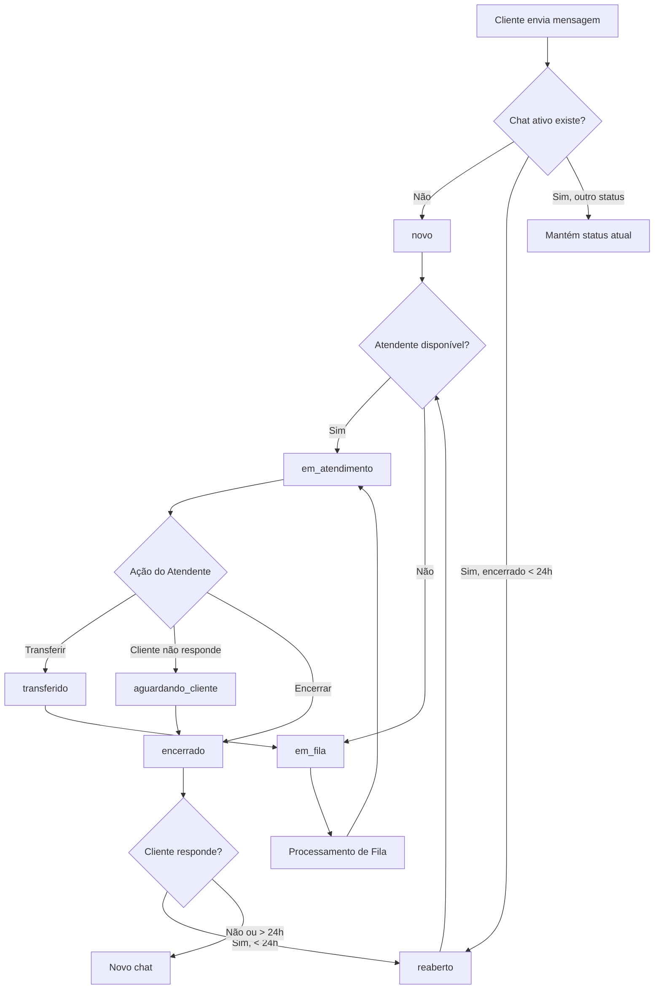

# 📊 Sistema de Status de Chat - Guia Completo

## 📖 Índice
1. [Status Disponíveis](#status-disponíveis)
2. [Transições de Status](#transições-de-status)
3. [Regras de Negócio](#regras-de-negócio)
4. [Componentes do Sistema](#componentes-do-sistema)
5. [Edge Functions](#edge-functions)
6. [Hooks e Serviços](#hooks-e-serviços)
7. [Exemplos de Uso](#exemplos-de-uso)

---

## 📌 Status Disponíveis

### 1. **novo** 🆕
- **Quando ocorre**: Mensagem recebida de cliente sem chat ativo
- **Descrição**: Chat recém-criado, aguardando processamento inicial
- **Próximos status possíveis**: `em_fila`, `em_atendimento`

### 2. **em_fila** ⏳
- **Quando ocorre**: Nenhum atendente disponível imediatamente
- **Descrição**: Chat aguardando na fila para ser atribuído
- **Campos atualizados**:
  - `tempo_espera_inicio`: timestamp do início da espera
  - `fila_id`: ID da fila atribuída
  - `atendente_atual_id`: null
- **Próximos status possíveis**: `em_atendimento`, `transferido`

### 3. **em_atendimento** ✅
- **Quando ocorre**: Chat atribuído a um atendente
- **Descrição**: Atendimento ativo com atendente
- **Campos atualizados**:
  - `atendente_atual_id`: ID do atendente
  - `tempo_atendimento_inicio`: timestamp do início do atendimento
  - `tempo_espera_inicio`: null
  - `bot_active`: false
- **Próximos status possíveis**: `aguardando_cliente`, `transferido`, `encerrado`

### 4. **transferido** 🔄
- **Quando ocorre**: Chat transferido para outra fila ou atendente
- **Descrição**: Chat em processo de transferência
- **Campos atualizados**:
  - `tempo_espera_inicio`: timestamp da transferência
  - Dependendo do tipo: `fila_id` ou `atendente_atual_id`
- **Próximos status possíveis**: `em_fila`, `em_atendimento`

### 5. **aguardando_cliente** ⏸️
- **Quando ocorre**: Cliente parou de responder por X minutos
- **Descrição**: Atendente esperando resposta do cliente
- **Campos mantidos**:
  - `atendente_atual_id`: mantém o atendente atual
- **Próximos status possíveis**: `em_atendimento`, `encerrado`, `reaberto`

### 6. **encerrado** ✔️
- **Quando ocorre**: Atendente encerra o chat
- **Descrição**: Atendimento finalizado
- **Campos atualizados**:
  - `tempo_encerramento`: timestamp do encerramento
  - `motivo_encerramento`: motivo informado pelo atendente
- **Próximos status possíveis**: `reaberto`

### 7. **reaberto** 🔄
- **Quando ocorre**: Cliente envia mensagem após encerramento (< 24h)
- **Descrição**: Chat reaberto automaticamente
- **Campos atualizados**:
  - `tempo_encerramento`: null
  - `numero_reaberturas`: incrementado
  - `reaberto_automaticamente`: true
  - `tempo_espera_inicio`: timestamp da reabertura
- **Próximos status possíveis**: `em_atendimento`, `em_fila`

---

## 🔄 Transições de Status

### Fluxo Principal



### Matriz de Transições Permitidas

| De ↓ / Para →        | novo | em_fila | em_atendimento | transferido | aguardando_cliente | encerrado | reaberto |
|----------------------|------|---------|----------------|-------------|-------------------|-----------|----------|
| **novo**             | -    | ✅      | ✅             | ❌          | ❌                | ❌        | ❌       |
| **em_fila**          | ❌   | -       | ✅             | ✅          | ❌                | ❌        | ❌       |
| **em_atendimento**   | ❌   | ❌      | -              | ✅          | ✅                | ✅        | ❌       |
| **transferido**      | ❌   | ✅      | ✅             | -           | ❌                | ❌        | ❌       |
| **aguardando_cliente** | ❌ | ❌      | ✅             | ✅          | -                 | ✅        | ❌       |
| **encerrado**        | ❌   | ❌      | ❌             | ❌          | ❌                | -         | ✅       |
| **reaberto**         | ❌   | ✅      | ✅             | ❌          | ❌                | ❌        | -        |

---

## 📋 Regras de Negócio

### 1. Reabertura Automática

**Condições para reabrir**:
- Chat estava `encerrado`
- Tempo desde encerramento < 24 horas
- Mesmos: `customer_id`, `estabelecimento_id`, `canal`

**Comportamento**:
1. Busca último chat encerrado nas últimas 24h
2. Reabrir com status `reaberto`
3. Incrementa `numero_reaberturas`
4. Tenta atribuir a atendente de carteira se disponível
5. Senão, coloca em fila para roteamento

**Se não puder reabrir**:
- Cria novo chat com status `novo`

### 2. Roteamento Automático

**Prioridade de roteamento**:
1. **Carteira Fixa**: Cliente com atendente dedicado
   - Verifica disponibilidade do atendente
   - Verifica limite de chats simultâneos
   - Atribui diretamente se possível

2. **Estratégia da Fila**: Define tipo de roteamento
   - `round_robin`: Alternância circular entre atendentes
   - `por_disponibilidade`: Atendente com menor carga
   - `por_skill`: Atendente mais qualificado para as skills necessárias
   - `por_prioridade`: Ordem de prioridade configurada na fila

3. **Fila de Espera**: Se nenhum atendente disponível
   - Chat permanece em `em_fila`
   - Será processado quando atendente ficar disponível

### 3. Timeout de Aguardando Cliente

**Configuração** (futuro):
- Tempo configurável por estabelecimento (padrão: 30 minutos)
- Após timeout, opções:
  - Encerrar automaticamente
  - Notificar atendente
  - Marcar para follow-up

### 4. Transferências

**Tipos de Transferência**:

#### Para Fila
- Remove atendente atual
- Coloca chat em `em_fila` ou `transferido`
- Define nova `fila_id`
- Roteamento acontece normalmente

#### Para Atendente
- Define novo `atendente_atual_id`
- Mantém status `transferido` temporariamente
- Muda para `em_atendimento` quando atendente aceita

**Registro**:
- Toda transferência é registrada em `chat_transferencias`
- Inclui: origem, destino, tipo, motivo, usuário que realizou

### 5. Prioridades

**Níveis**:
- `baixa` 🟢
- `normal` 🟡 (padrão)
- `alta` 🟠
- `urgente` 🔴

**Impacto**:
- Chats com prioridade mais alta são processados primeiro na fila
- Ordem: urgente > alta > normal > baixa
- Em caso de empate, usa tempo de espera (FIFO)

---

## 🧩 Componentes do Sistema

### 1. ChatStatusManager

**Localização**: `src/components/atendimento/ChatStatusManager.tsx`

**Funcionalidades**:
- Exibe status atual com ícone
- Seletor de prioridade
- Botões de ação:
  - Transferir (abre `TransferenciaDialog`)
  - Tags (abre `ChatTagsManager`)
  - Em Espera (muda para `aguardando_cliente`)
  - Encerrar (abre `EncerrarChatDialog`)
  - Reabrir (se status = `encerrado`)

**Uso**:
```tsx
<ChatStatusManager
  chatId={chatId}
  currentStatus={chat.chat_status}
  currentPrioridade={chat.prioridade}
  estabelecimentoId={estabelecimentoId}
  filaId={chat.fila_id}
  atendenteId={chat.atendente_atual_id}
  onRefresh={() => loadConversations()}
/>
```

### 2. TransferenciaDialog

**Localização**: `src/components/atendimento/TransferenciaDialog.tsx`

**Funcionalidades**:
- Tipo de transferência (Fila ou Atendente)
- Seleção de destino
- Motivo (opcional)
- Registra em `chat_transferencias`
- Atualiza status do chat

### 3. EncerrarChatDialog

**Localização**: `src/components/atendimento/EncerrarChatDialog.tsx`

**Funcionalidades**:
- Motivos pré-definidos comuns
- Campo para motivo customizado
- Salva `motivo_encerramento`
- Muda status para `encerrado`
- Registra `tempo_encerramento`

### 4. ChatTagsManager

**Localização**: `src/components/atendimento/ChatTagsManager.tsx`

**Funcionalidades**:
- Adicionar tags ao chat
- Remover tags aplicadas
- Buscar tags disponíveis
- Exibir tags com cores personalizadas

---

## ⚙️ Edge Functions

### 1. reabrir-chat-automatico

**Endpoint**: `supabase/functions/reabrir-chat-automatico`

**Entrada**:
```json
{
  "customerId": "uuid",
  "estabelecimentoId": "uuid",
  "canal": "whatsapp"
}
```

**Saída (sucesso)**:
```json
{
  "success": true,
  "conversationId": "uuid",
  "numeroReaberturas": 2
}
```

**Saída (criar novo)**:
```json
{
  "success": false,
  "shouldCreateNew": true,
  "message": "Nenhum chat recente encontrado"
}
```

**Lógica**:
1. Busca último chat `encerrado` do cliente (< 24h)
2. Verifica se pode reabrir
3. Atualiza status para `reaberto`
4. Tenta rotear automaticamente
5. Registra evento de reabertura

### 2. processar-fila-atendimento

**Endpoint**: `supabase/functions/processar-fila-atendimento`

**Entrada**: Nenhuma (processa todas as filas)

**Saída**:
```json
{
  "success": true,
  "totalProcessed": 10,
  "totalAssigned": 8
}
```

**Lógica**:
1. Busca todos os chats em `em_fila`
2. Para cada chat:
   - Verifica carteira fixa
   - Aplica estratégia de roteamento da fila
   - Atribui a atendente disponível
3. Ordena por prioridade e tempo de espera

**Quando executar**:
- Periodicamente (via cron/scheduler)
- Quando atendente muda status para `disponivel`
- Quando atendente encerra um chat

### 3. rotear-chat-automatico

**Endpoint**: `supabase/functions/rotear-chat-automatico`

**Entrada**:
```json
{
  "conversationId": "uuid",
  "customerId": "uuid",
  "estabelecimentoId": "uuid",
  "canal": "whatsapp",
  "filaId": "uuid (opcional)",
  "prioridade": "alta (opcional)"
}
```

**Lógica**:
1. Identifica fila apropriada
2. Verifica carteira fixa
3. Seleciona atendente pela estratégia
4. Atribui ou coloca em fila

---

## 🪝 Hooks e Serviços

### 1. useChatStatus

**Localização**: `src/hooks/useChatStatus.ts`

**Métodos**:

```typescript
const {
  loading,
  mudarStatus,
  mudarPrioridade,
  encerrarChat,
  reabrirChat,
  colocarEmEspera
} = useChatStatus();

// Mudar status
await mudarStatus(chatId, 'em_atendimento', {
  atendenteId: 'uuid'
});

// Mudar prioridade
await mudarPrioridade(chatId, 'urgente');

// Encerrar
await encerrarChat(chatId, 'Problema resolvido');

// Reabrir
await reabrirChat(chatId);

// Colocar em espera
await colocarEmEspera(chatId);
```

### 2. useOmnichannelRouting

**Localização**: `src/hooks/useOmnichannelRouting.ts`

**Métodos**:

```typescript
const {
  handleIncomingMessage,
  rotearChat,
  setupMessageListener
} = useOmnichannelRouting();

// Processar mensagem recebida
const conversationId = await handleIncomingMessage(
  customerId,
  estabelecimentoId,
  'whatsapp'
);

// Rotear chat manualmente
await rotearChat(conversationId, customerId, estabelecimentoId, 'whatsapp');

// Configurar listener automático
useEffect(() => {
  const cleanup = setupMessageListener(estabelecimentoId);
  return cleanup;
}, [estabelecimentoId]);
```

---

## 💡 Exemplos de Uso

### Exemplo 1: Cliente Envia Primeira Mensagem

```typescript
// Hook automático detecta mensagem
setupMessageListener(estabelecimentoId);

// Flow:
// 1. Detecta INSERT em messages com sender != 'agent'
// 2. Busca conversa relacionada
// 3. handleIncomingMessage() processa:
//    - Verifica se tem chat ativo
//    - Tenta reabrir se tinha chat encerrado recente
//    - Cria novo chat se necessário
// 4. Roteia automaticamente
// 5. Atendente recebe notificação
```

### Exemplo 2: Atendente Transfere Chat

```tsx
<TransferenciaDialog
  open={true}
  onOpenChange={setOpen}
  chatId="chat-123"
  estabelecimentoId="estab-456"
  currentFilaId="fila-789"
  currentAtendenteId="atend-101"
/>

// Usuário seleciona:
// - Tipo: "Para Fila"
// - Destino: Fila "Financeiro"
// - Motivo: "Cliente quer falar sobre pagamento"

// Sistema:
// 1. Registra em chat_transferencias
// 2. Update conversations:
//    - chat_status: 'em_fila'
//    - fila_id: fila-financeiro
//    - atendente_atual_id: null
//    - tempo_espera_inicio: now()
// 3. Chat entra na fila "Financeiro"
// 4. Será processado pelo rotear-chat-automatico
```

### Exemplo 3: Encerrar Chat

```tsx
<EncerrarChatDialog
  open={true}
  onOpenChange={setOpen}
  chatId="chat-123"
  onSuccess={() => loadConversations()}
/>

// Usuário seleciona:
// - Motivo: "Problema resolvido"

// Sistema:
// 1. Update conversations:
//    - chat_status: 'encerrado'
//    - tempo_encerramento: now()
//    - motivo_encerramento: "Problema resolvido"
// 2. Mensagem de sistema: "✔️ Chat encerrado"
// 3. Atendente disponível para novos chats
// 4. Se cliente responder < 24h, chat reabre automaticamente
```

### Exemplo 4: Processamento de Fila Automático

```typescript
// Executado periodicamente ou ao mudar status de atendente

await supabase.functions.invoke('processar-fila-atendimento');

// Sistema:
// 1. Busca todos os chats em 'em_fila'
// 2. Ordena por: prioridade (desc), tempo_espera_inicio (asc)
// 3. Para cada chat:
//    a. Verifica carteira fixa
//    b. Busca atendentes disponíveis da fila
//    c. Aplica estratégia de roteamento
//    d. Atribui ao melhor atendente
// 4. Retorna quantos chats foram atribuídos
```

---

## 🔐 Considerações de Segurança

### RLS Policies

Todas as tabelas devem ter políticas RLS adequadas:

- `conversations`: usuários só veem chats de seu estabelecimento
- `chat_transferencias`: apenas atendentes/supervisores
- `chat_tags_aplicadas`: apenas usuários autenticados do estabelecimento

### Validações

- Atendente só pode encerrar chats que estão atribuídos a ele
- Transferências validam permissões do usuário
- Reabertura verifica janela de 24 horas
- Roteamento respeita limites de chats por atendente

---

## 📊 Métricas e Monitoramento

### Métricas Importantes

1. **Tempo Médio de Espera**: `tempo_atendimento_inicio - tempo_espera_inicio`
2. **Taxa de Reabertura**: `COUNT(numero_reaberturas > 0) / COUNT(*)`
3. **Taxa de Resolução no Primeiro Contato**: `COUNT(numero_reaberturas = 0 AND encerrado) / COUNT(*)`
4. **Distribuição de Status**: COUNT por cada status
5. **Tempo Médio de Atendimento**: `tempo_encerramento - tempo_atendimento_inicio`

### Dashboard Recomendado

- Chats ativos por status
- Tempo médio de espera na fila
- Atendentes disponíveis vs ocupados
- Taxa de reabertura por dia/semana
- Motivos de encerramento mais comuns

---

## 🚀 Melhorias Futuras

1. **Timeout Configurável**: Tempo para `aguardando_cliente`
2. **SLA por Prioridade**: Alertas se tempo de espera exceder limite
3. **Auto-distribuição**: Quando atendente fica disponível
4. **Previsão de Demanda**: ML para prever picos de atendimento
5. **Chatbot de Triagem**: Coletar informações antes de rotear
6. **Feedback do Cliente**: Avaliação após encerramento
7. **Replay de Conversa**: Visualizar histórico completo
8. **Relatórios Avançados**: Dashboards personalizados
