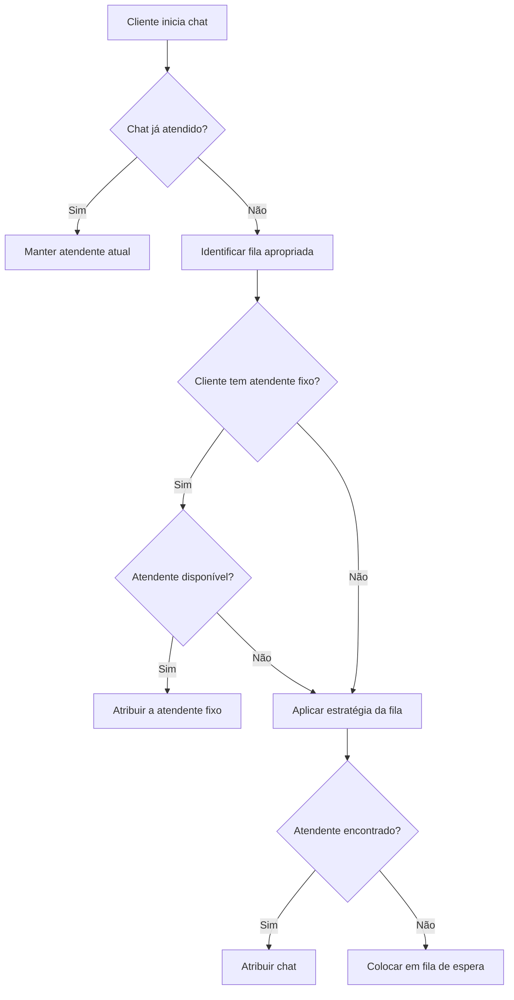
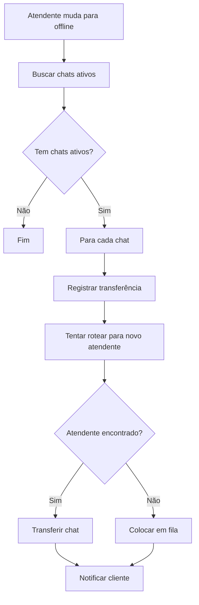
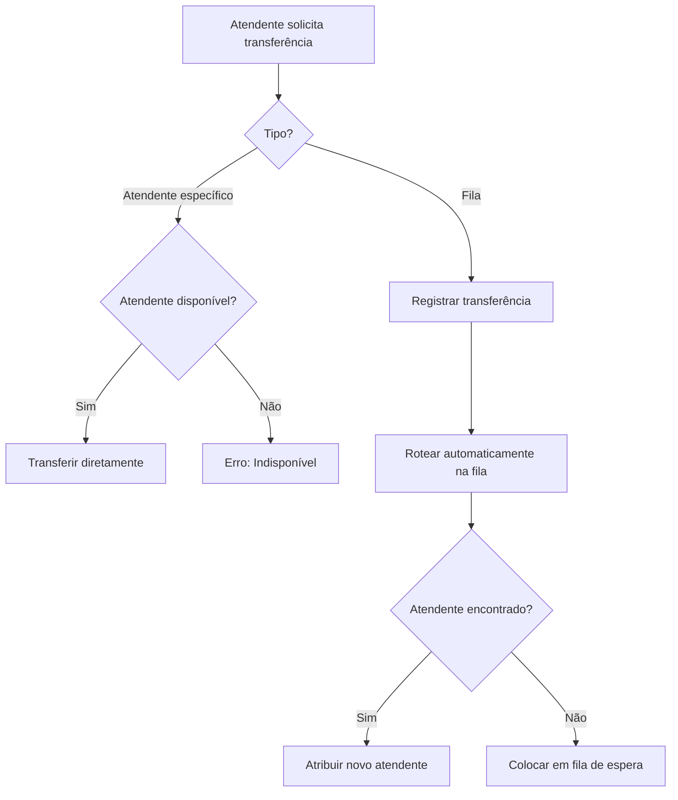

# 🎯 Guia Completo do Sistema de Roteamento Omnichannel

## 📋 Índice

1. [Visão Geral](#visão-geral)
2. [Funcionalidades](#funcionalidades)
3. [Como Usar](#como-usar)
4. [Edge Functions](#edge-functions)
5. [Estratégias de Roteamento](#estratégias-de-roteamento)
6. [Fluxos de Trabalho](#fluxos-de-trabalho)
7. [Exemplos de Uso](#exemplos-de-uso)

---

## 🎯 Visão Geral

O Sistema de Roteamento Omnichannel é responsável por distribuir automaticamente os chats dos clientes para os atendentes mais adequados, baseado em múltiplos critérios como disponibilidade, habilidades, carga de trabalho e relacionamento com o cliente.

### Principais Componentes

- **Identificação de Fila**: Define qual fila receberá o chat
- **Seleção de Atendente**: Escolhe o melhor atendente para o atendimento
- **Gestão de Carteira**: Prioriza atendentes que já tem relacionamento com o cliente
- **Realocação Automática**: Redistribui chats quando atendentes ficam indisponíveis
- **Transferências**: Permite movimentação manual de chats

---

## ⚡ Funcionalidades

### 1. Identificação Automática de Fila

O sistema identifica a fila apropriada baseado em:

✅ **Opção escolhida no bot**  
✅ **Palavras-chave detectadas**  
✅ **Canal de entrada** (WhatsApp, Telegram, WebChat)  
✅ **Histórico do cliente** (última fila usada)  
✅ **Prioridade configurada**

### 2. Seleção Inteligente de Atendente

Considera automaticamente:

✅ **Disponibilidade** - somente quem está "Disponível"  
✅ **Skills** - seleciona quem possui as habilidades necessárias  
✅ **Carga de trabalho** - prioriza quem tem menos chats ativos  
✅ **Carteira fixa** - respeita relacionamento cliente-atendente  
✅ **Limite de chats** - respeita o máximo configurado por atendente

### 3. Regras Especiais

🔄 **Fila de Espera**: Chat aguarda se nenhum atendente estiver disponível  
🔄 **Realocação Automática**: Redistribui chats quando atendente sai  
🔄 **Transferência Manual**: Permite mover chats entre atendentes/filas  
🔄 **Priorização**: Clientes podem ter prioridade alta/urgente

---

## 🚀 Como Usar

### 1. Configuração Inicial

#### a) Criar Filas de Atendimento

```typescript
// Exemplo: Criar fila de suporte
{
  nome: "Suporte Técnico",
  descricao: "Atendimento para problemas técnicos",
  tipo_roteamento: "por_skill", // ou: round_robin, por_disponibilidade, por_prioridade
  max_chats_por_atendente: 5,
  ativa: true,
  mensagem_fila: "Você está na fila de suporte. Aguarde um momento..."
}
```

#### b) Criar Skills

```typescript
// Exemplo: Skills para a fila
{
  nome: "Suporte Técnico",
  descricao: "Conhecimento em problemas técnicos",
  nivel_maximo: 5
}
```

#### c) Associar Atendentes às Filas

```typescript
// Atribuir atendente à fila
{
  atendente_id: "uuid-do-atendente",
  fila_id: "uuid-da-fila",
  prioridade: 1 // Maior número = maior prioridade
}
```

#### d) Atribuir Skills aos Atendentes

```typescript
// Dar skill ao atendente
{
  atendente_id: "uuid-do-atendente",
  skill_id: "uuid-da-skill",
  nivel: 4 // Nível de proficiência (1-5)
}
```

### 2. Roteamento Automático via Bot

No seu bot, chame a edge function de roteamento:

```typescript
// Exemplo: Rotear chat após coletar informações
const { data, error } = await supabase.functions.invoke('rotear-chat-automatico', {
  body: {
    conversationId: chatId,
    customerId: clienteId,
    estabelecimentoId: estabelecimentoId,
    canal: 'whatsapp',
    filaId: 'uuid-da-fila', // Opcional
    palavrasChave: ['suporte', 'problema'], // Opcional
    opcaoBot: 'suporte_tecnico', // Opcional
    prioridade: 'alta' // Opcional: 'baixa', 'normal', 'alta', 'urgente'
  }
});

if (data?.atendenteId) {
  console.log(`Chat atribuído ao atendente ${data.atendenteId}`);
} else if (data?.filaId) {
  console.log(`Chat em fila de espera: ${data.fila}`);
}
```

### 3. Transferência Manual

```typescript
// Transferir para outro atendente
const { data } = await supabase.functions.invoke('transferir-chat', {
  body: {
    chatId: 'uuid-do-chat',
    tipo: 'atendente',
    atendenteDestinoId: 'uuid-do-atendente-destino',
    motivo: 'Cliente solicitou falar com especialista',
    realizadoPor: 'uuid-do-usuario-logado'
  }
});

// Transferir para fila (roteamento automático)
const { data } = await supabase.functions.invoke('transferir-chat', {
  body: {
    chatId: 'uuid-do-chat',
    tipo: 'fila',
    filaDestinoId: 'uuid-da-fila-destino',
    motivo: 'Escalando para nível 2',
    realizadoPor: 'uuid-do-usuario-logado'
  }
});
```

### 4. Carteira Fixa de Clientes

```typescript
// Associar cliente a um atendente específico
await supabase.from('atendente_carteiras').insert({
  atendente_id: 'uuid-do-atendente',
  customer_id: 'uuid-do-cliente',
  estabelecimento_id: 'uuid-do-estabelecimento',
  ativa: true
});

// O sistema automaticamente priorizará este atendente para este cliente
```

### 5. Realocação quando Atendente Sai

```typescript
// Ao mudar status do atendente para offline/ausente
const { data: atendente } = await supabase
  .from('atendentes')
  .update({ status: 'offline' })
  .eq('id', atendenteId)
  .select()
  .single();

// Realocar chats automaticamente
await supabase.functions.invoke('realocar-chats-atendente', {
  body: {
    atendenteId: atendenteId,
    estabelecimentoId: estabelecimentoId,
    motivoRealocacao: 'Atendente encerrou expediente'
  }
});
```

---

## 🔧 Edge Functions

### 1. `rotear-chat-automatico`

**Função principal de roteamento**

**Endpoint**: `/functions/v1/rotear-chat-automatico`

**Parâmetros**:
```typescript
{
  conversationId: string;      // ID da conversa
  customerId: string;          // ID do cliente
  estabelecimentoId: string;   // ID do estabelecimento
  canal: string;               // Canal: 'whatsapp', 'telegram', 'webchat'
  filaId?: string;             // ID da fila (opcional, sistema identifica)
  palavrasChave?: string[];    // Palavras para identificar fila
  opcaoBot?: string;           // Opção escolhida no bot
  prioridade?: string;         // 'baixa', 'normal', 'alta', 'urgente'
}
```

**Retorno**:
```typescript
{
  success: true,
  atendenteId?: string,        // Se atribuído a atendente
  filaId?: string,             // Se colocado em fila
  fila?: string,               // Nome da fila
  tipo: string                 // Tipo de resultado
}
```

### 2. `transferir-chat`

**Transferência manual de chats**

**Endpoint**: `/functions/v1/transferir-chat`

**Parâmetros**:
```typescript
{
  chatId: string;              // ID do chat
  tipo: 'atendente' | 'fila';  // Tipo de transferência
  atendenteDestinoId?: string; // Para transferência direta
  filaDestinoId?: string;      // Para transferência para fila
  motivo?: string;             // Motivo da transferência
  realizadoPor: string;        // Quem realizou
}
```

### 3. `realocar-chats-atendente`

**Realocação automática quando atendente sai**

**Endpoint**: `/functions/v1/realocar-chats-atendente`

**Parâmetros**:
```typescript
{
  atendenteId: string;         // ID do atendente
  estabelecimentoId: string;   // ID do estabelecimento
  motivoRealocacao?: string;   // Motivo da realocação
}
```

### 4. `processar-fila-atendimento`

**Processa periodicamente chats em fila**

**Endpoint**: `/functions/v1/processar-fila-atendimento`

Executar via cron job ou periodicamente para processar chats aguardando atendente.

---

## 📊 Estratégias de Roteamento

### 1. Round Robin (Alternância Circular)

Distribui chats alternando entre atendentes disponíveis.

```sql
tipo_roteamento = 'round_robin'
```

**Quando usar**: Para distribuição igualitária, sem considerar habilidades específicas.

**Comportamento**:
- Mantém histórico de último atendente que recebeu chat
- Próximo chat vai para o próximo atendente na lista
- Volta ao início quando chega ao fim da lista

### 2. Por Disponibilidade (Menor Carga)

Prioriza atendente com menos chats ativos.

```sql
tipo_roteamento = 'por_disponibilidade'
```

**Quando usar**: Para balancear carga de trabalho automaticamente.

**Comportamento**:
- Conta chats ativos de cada atendente
- Escolhe quem tem menos chats
- Em caso de empate, usa round robin

### 3. Por Skill (Habilidades)

Seleciona atendente com as habilidades necessárias.

```sql
tipo_roteamento = 'por_skill'
```

**Quando usar**: Para atendimentos especializados.

**Comportamento**:
- Verifica skills requeridas pela fila
- Filtra atendentes que possuem todas as skills
- Escolhe atendente com maior nível médio de skill
- Se nenhum qualificado, chat fica em fila

**Exemplo**:
```typescript
// Fila requer:
// - Inglês (nível mínimo: 3)
// - Suporte Técnico (nível mínimo: 4)

// Atendente A: Inglês=5, Suporte=4 ✅ Qualificado
// Atendente B: Inglês=2, Suporte=5 ❌ Não qualificado (Inglês < 3)
// Atendente C: Inglês=4, Suporte=3 ❌ Não qualificado (Suporte < 4)
```

### 4. Por Prioridade

Respeita ordem de prioridade dos atendentes na fila.

```sql
tipo_roteamento = 'por_prioridade'
```

**Quando usar**: Para hierarquia (ex: sênior antes de júnior).

**Comportamento**:
- Ordena atendentes por campo `prioridade`
- Sempre tenta atribuir para maior prioridade disponível
- Se não disponível, tenta próximo na ordem

### 5. Por Carteira

Prioriza atendente que já tem relacionamento com cliente.

```sql
tipo_roteamento = 'por_carteira'
```

**Quando usar**: Para continuidade de atendimento.

**Comportamento**:
- Verifica se cliente tem atendente fixo
- Se sim e disponível, atribui a ele
- Se não, usa estratégia de disponibilidade

---

## 🔄 Fluxos de Trabalho

### Fluxo 1: Novo Chat Entrando



### Fluxo 2: Atendente Fica Offline



### Fluxo 3: Transferência Manual



---

## 💡 Exemplos de Uso

### Exemplo 1: Bot com Menu de Opções

```typescript
// No seu bot, após coletar a opção do cliente
const opcao = await coletarOpcao(); // Ex: "1 - Suporte", "2 - Vendas"

let filaId;
let palavrasChave;

switch(opcao) {
  case '1':
    palavrasChave = ['suporte', 'problema', 'ajuda'];
    break;
  case '2':
    palavrasChave = ['vendas', 'comprar', 'produto'];
    break;
  case '3':
    palavrasChave = ['financeiro', 'boleto', 'pagamento'];
    break;
}

// Rotear baseado na escolha
const resultado = await supabase.functions.invoke('rotear-chat-automatico', {
  body: {
    conversationId: chatId,
    customerId: clienteId,
    estabelecimentoId: estabelecimentoId,
    canal: 'whatsapp',
    palavrasChave: palavrasChave,
    opcaoBot: opcao
  }
});
```

### Exemplo 2: Priorização por Urgência

```typescript
// Detectar urgência nas mensagens do cliente
const mensagem = cliente.ultimaMensagem.toLowerCase();
const isUrgente = mensagem.includes('urgente') || 
                  mensagem.includes('emergência') ||
                  mensagem.includes('agora');

const prioridade = isUrgente ? 'urgente' : 'normal';

// Rotear com prioridade
await supabase.functions.invoke('rotear-chat-automatico', {
  body: {
    conversationId: chatId,
    customerId: clienteId,
    estabelecimentoId: estabelecimentoId,
    canal: 'whatsapp',
    prioridade: prioridade
  }
});

// Atualizar visualmente na fila
if (prioridade === 'urgente') {
  await enviarMensagem('⚡ Seu atendimento foi priorizado!');
}
```

### Exemplo 3: Horário Comercial

```typescript
// Verificar horário antes de rotear
const agora = new Date();
const hora = agora.getHours();
const diaUtil = agora.getDay() >= 1 && agora.getDay() <= 5;
const horarioComercial = diaUtil && hora >= 8 && hora <= 18;

if (horarioComercial) {
  // Rotear normalmente
  await supabase.functions.invoke('rotear-chat-automatico', { ... });
} else {
  // Fora do horário: Informar e coletar dados
  await enviarMensagem('Estamos fora do horário de atendimento (8h-18h).');
  await enviarMensagem('Deixe sua mensagem que retornaremos amanhã.');
  
  // Colocar em fila específica para fora de horário
  await supabase.functions.invoke('rotear-chat-automatico', {
    body: {
      conversationId: chatId,
      customerId: clienteId,
      estabelecimentoId: estabelecimentoId,
      canal: 'whatsapp',
      palavrasChave: ['fora_horario']
    }
  });
}
```

### Exemplo 4: Monitoramento de Fila

```typescript
// Verificar tamanho da fila periodicamente
const { data: chatsEmFila } = await supabase
  .from('conversations')
  .select('id')
  .eq('chat_status', 'aguardando_atendente')
  .eq('estabelecimento_id', estabelecimentoId);

const tamanhoFila = chatsEmFila?.length || 0;

if (tamanhoFila > 10) {
  // Alertar supervisor
  await notificarSupervisor(`⚠️ Fila com ${tamanhoFila} clientes aguardando!`);
  
  // Processar fila imediatamente
  await supabase.functions.invoke('processar-fila-atendimento');
}
```

---

## 🎓 Boas Práticas

### 1. Configuração de Filas

✅ **Use nomes descritivos** para filas  
✅ **Configure mensagens de fila** personalizadas  
✅ **Defina prioridades** claras  
✅ **Estabeleça limites** de chats por atendente  

### 2. Gestão de Skills

✅ **Seja específico** nas skills (ex: "Inglês", não "Idiomas")  
✅ **Use escala de 1-5** consistentemente  
✅ **Atualize regularmente** as skills dos atendentes  
✅ **Documente** o que cada nível significa  

### 3. Monitoramento

✅ **Acompanhe** tempo médio em fila  
✅ **Monitore** distribuição de chats por atendente  
✅ **Analise** taxa de transferências  
✅ **Revise** periodicamente as configurações  

### 4. Escalabilidade

✅ **Use cron jobs** para processar filas regularmente  
✅ **Configure alertas** para filas grandes  
✅ **Balanceie** carga entre atendentes  
✅ **Ajuste** limites conforme necessário  

---

## 📞 Suporte

Para dúvidas ou problemas, consulte:

- Logs das edge functions no dashboard do Supabase
- Tabela `chat_transferencias` para histórico
- Métricas em `metricas_atendente`

---

**Última atualização**: 2025  
**Versão**: 1.0.0